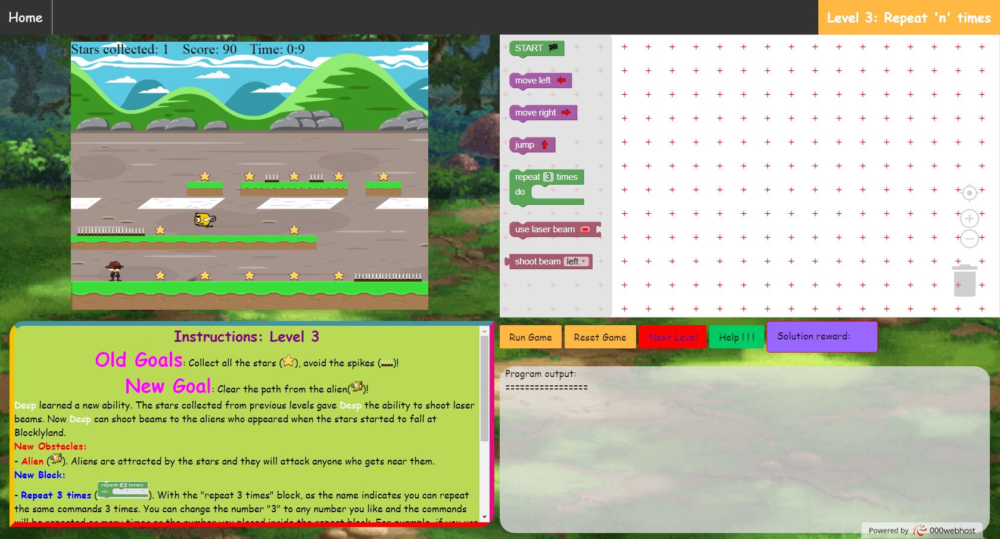

# BlocklyScript: An online educational game for cultivating Computational Thinking skills to young students

## This repository includes:
1. The files of the online game (BlocklyScriptGame)
2. The SQL dump which data of player's progression (BlocklyScriptDataBase)

### The BlocklyScriptGame folder
* This folder contains the pages of your BlocklyScript website.
* In order to login to the site open a browser and visit the BlocklyScriptGame/login.php
* From login.php you can login to the home page of the game or redirect to register page where you can create a new account

